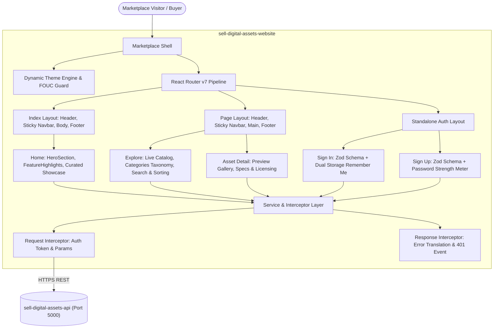
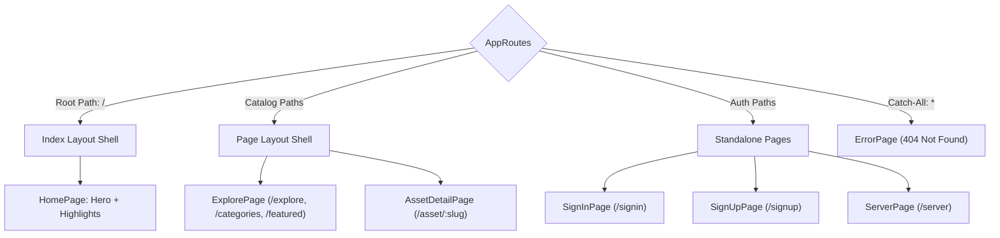
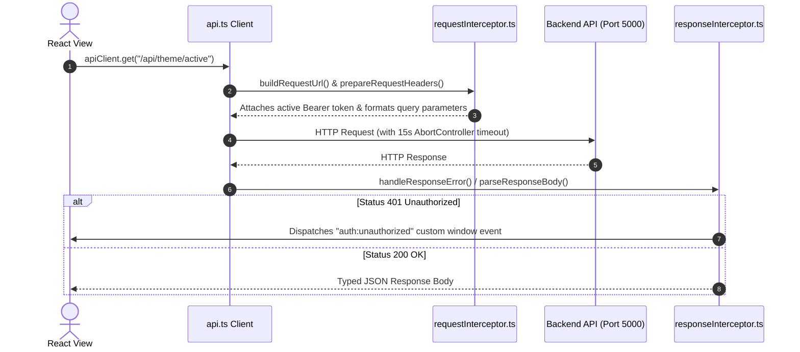

# Sell Digital Assets Marketplace — System Architecture & Technical Specifications

> **System**: Client Marketplace & Digital Asset Exploration Portal (`sell-digital-assets-website`).  
> **Tech Stack**: React 19, TypeScript 6 (Strict Mode), Vite 8, Tailwind CSS v4, React Router v7, TanStack Query v5, Zod, Sonner, Lucide React.  
> **Deployment Target**: Vercel (Edge CDN + SPA Rewrites).

---

## 1. Architectural Overview

The `sell-digital-assets-website` portal serves as the primary storefront and buyer discovery experience for the Sell Digital Assets ecosystem. Built with a modern **Single Page Application (SPA)** architecture, the application delivers sub-second navigation, dynamic theme synchronization with the backend engine, and seamless authentication.



---

## 2. Client Routing & Layout Topology

All routes are declared in `src/routes/AppRoutes.tsx` with asynchronous code-splitting via `React.lazy()` and `<Suspense>`:



| Path | Layout | Description |
| :--- | :--- | :--- |
| `/` | `Index` | Homepage showcase featuring hero banner, value propositions, and curated asset highlights |
| `/explore` | `Page` | Live catalog exploration with full-text search, categories filter, and sorting |
| `/categories` | `Page` | Category-specific asset catalog view |
| `/featured` | `Page` | Curated featured digital assets showcase |
| `/asset/:slug` | `Page` | Detailed digital asset view with previews, author information, and license tiers |
| `/signin` | Standalone | Secure authentication sign-in with Remember Me preference |
| `/signup` | Standalone | User registration with real-time Zod schema validation and password strength indicator |
| `/server` | Standalone | Server maintenance and unexpected error status fallback |
| `*` | Standalone | Comprehensive 404 Not Found error layout |

---

## 3. Directory & File Organization

```text
sell-digital-assets-website/
├── public/                     # Static assets (favicons, manifest, logo.png)
├── src/
│   ├── assets/                 # Plus Jakarta Sans variable font and local graphics
│   ├── components/
│   │   ├── common/             # Shared presentation components (AssetCard.tsx)
│   │   └── ui/                 # Reusable UI primitives (Button, Card, Input, Checkbox, Badge, Modal, Skeleton, Spinner, EmptyState)
│   ├── config/                 # Environment variables (env.ts)
│   ├── context/                # Theme and Authentication context contracts
│   ├── features/               # Feature-sliced domain modules
│   │   ├── auth/               # Sign-in and sign-up mutations, Zod schemas, and types
│   │   └── website/            # HeroSection, FeatureHighlights, ExplorePage, AssetDetailPage
│   ├── hooks/                  # Custom React hooks (useAuth, useTheme, useDebounce, useLocalStorage)
│   ├── layouts/website/        # Website shell layouts (Header, Navbar, Body, Footer, Index, Page, pages/)
│   ├── lib/
│   │   ├── icons/              # Unified SVG icon library (semantic.tsx, brands.tsx)
│   │   ├── queryClient.ts      # TanStack Query client configuration
│   │   └── utils.ts            # Utility functions (cn class merger)
│   ├── provider/               # Context providers (ThemeProvider, AuthProvider)
│   ├── routes/                 # Routing pipeline (AppRoutes.tsx, ProtectedRoute.tsx)
│   ├── services/               # HTTP client & API service layer
│   │   ├── api.ts              # Centralized fetch client with AbortController timeout management
│   │   ├── queryKeys.ts        # TanStack Query cache key definitions
│   │   ├── interceptors/       # Request and response interceptor pipeline
│   │   └── v1/                 # Domain API services (assetService.ts, authService.ts, themeService.ts)
│   ├── theme/                  # Theme styles, Tailwind CSS v4 stylesheets, and tokens
│   ├── types/                  # Domain TypeScript interfaces (asset.ts, user.ts)
│   ├── utils/                  # Currency, date, and file formatting utilities
│   ├── App.tsx                 # Root application component
│   └── main.tsx                # Client application bootstrap
├── eslint.config.js            # Flat ESLint configuration with JSX A11y
├── package.json
├── tsconfig.app.json
├── vercel.json                 # Vercel deployment & SPA rewrite routing
└── vite.config.ts              # Vite bundler configuration & dev proxy (Port 5173)
```

---

## 4. HTTP Interceptor Pipeline & API Client

All network communications traverse the centralized `api.ts` client:



---

## 5. Dynamic Theme Engine & Zero-FOUC Implementation

1. **Synchronous Head Evaluation**:
   - `index.html` contains an inline JavaScript snippet that reads local storage or system preferences (`prefers-color-scheme`) and applies the `.dark` class to `<html>` prior to the initial paint.
2. **Dynamic Backend Palette Synchronization**:
   - `src/services/v1/themeService.ts` queries the backend active theme (`GET /api/theme/active` or `/theme/active`) and maps color tokens to CSS variables (`--md-sys-color-primary`, `--md-sys-color-surface`, etc.) on the `:root` element.
3. **Tailwind CSS v4 Integration**:
   - The `@theme` directive in `src/theme/styles/theme.css` maps custom properties directly to Tailwind utility classes.

---

## 6. Authentication & Session Security

1. **Dual Storage Architecture**:
   - **Persistent (`localStorage`)**: Used when the user selects "Remember Me", preserving session access across browser restarts.
   - **Ephemeral (`sessionStorage`)**: Used when "Remember Me" is unselected, terminating credentials when the browser tab is closed.
2. **Schema-Driven Form Validation**:
   - Sign-in and sign-up forms utilize **React Hook Form** paired with **Zod** schemas (`signInSchema.ts`, `signUpSchema.ts`).
3. **Session Purging**:
   - Terminating a session cleans all token keys (`auth_token`, `auth_refresh_token`, `auth_user`) from browser storage.

---

## 7. Build & Quality Assurance Standards

```powershell
# Type checking
npx tsc -b

# Linting with JSX Accessibility rules
npm run lint

# Production build
npm run build
```

