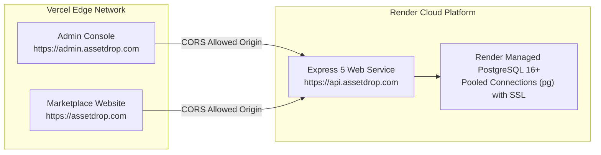

# Sell Digital Assets — Platform Ecosystem Architecture Guide

> **Ecosystem**: Sell Digital Assets / AssetDrop Multi-Portal Platform  
> **Repositories**:  
> 1. `sell-digital-assets-api` (Backend REST API & Database Engine — Port 5000)  
> 2. `sell-digital-assets-website` (Client Marketplace & Catalog Portal — Port 5173)  
> 3. `sell-digital-assets-admin` (Operational Admin Console — Port 5174)

---

## 1. System Ecosystem Topology

The platform consists of three decoupled repositories operating against a unified PostgreSQL database, synchronized design tokens, and centralized configuration:

```mermaid
graph TB
    subgraph "Clients Layer (Vercel Edge Network)"
        WebClient["sell-digital-assets-website<br/>(React 19 + React Router v7 + TanStack Query)<br/>Port: 5173"]
        AdminClient["sell-digital-assets-admin<br/>(React 19 + Vite 8 + In-Memory SWR)<br/>Port: 5174"]
    end

    subgraph "Backend Engine (Render Cloud Platform)"
        API["sell-digital-assets-api<br/>(Node.js 22 + Express 5 + TypeScript ESM)<br/>Port: 5000"]
    end

    subgraph "Persistence Layer (PostgreSQL 16+ Database)"
        PG[("PostgreSQL 16+<br/>Extensions: citext, pgcrypto<br/>Tables: currencies, organizations, roles,<br/>users, categories, themes, theme_settings")]
    end

    WebClient -->|Catalog, Dynamic Theme, Auth| API
    AdminClient -->|Organization Settings, Branding, Appearance, Users, Categories| API
    API -->|Connection Pool (pg) with SSL| PG
```

---

## 2. Port Allocation & Local Development Matrix

| Service | Technology | Local Port | Default URL | Environment Role |
| :--- | :--- | :--- | :--- | :--- |
| **API** | Express 5 / Node.js 22 | `5000` | `http://localhost:5000` | Backend REST engine, PostgreSQL persistence, Swagger UI (`/doc`), dynamic CSS (`/theme/theme.css`) |
| **Website** | React 19 / Vite 8 | `5173` | `http://localhost:5173` | Public marketplace, catalog explore, asset showcase, buyer/creator portal |
| **Admin** | React 19 / Vite 8 | `5174` | `http://localhost:5174` | Superadmin console, branding governance, appearance/theme editor, users directory, categories taxonomy |

---

## 3. Cross-Repository Data Contracts & Flows

### A. Authentication & Role Segregation
* **Unified JWT Standard**: Both client portals consume JSON Web Tokens issued by `sell-digital-assets-api` (`POST /api/auth/login` or `POST /api/auth/register`).
* **Token Lifecycle**: Short-lived access tokens (15m) paired with long-lived refresh tokens (7d).
* **Storage Strategy**:
  * **Remember Me Enabled**: Persistent storage in `localStorage`.
  * **Remember Me Disabled**: Session storage in `sessionStorage`.
* **Roles**:
  * `admin`: Full administrative access to `sell-digital-assets-admin` and protected `/api/*` administrative mutation endpoints.
  * `creator` / `seller`: Permitted to manage digital assets and inspect sales performance.
  * `user` / `buyer`: Standard customer role for browsing and accessing digital assets.

### B. Organization Branding & Singleton Configuration
* The `organizations` singleton table (`id = 1`) in PostgreSQL stores the platform title, legal entity name, tagline, description, support contact, logo URLs, favicon, default currency, platform fee percentage, and payout threshold.
* The table is guarded against accidental `DELETE` operations via a PostgreSQL rule (`no_delete_organizations`) and against `TRUNCATE` via a security trigger (`prevent_table_truncate()`).
* Administrators configure organization details through `sell-digital-assets-admin` (under the **Branding** and **Settings** tabs), mutating `/api/organizations`. Both frontends and Swagger documentation reflect these branding updates in real time.

### C. PostgreSQL-Driven Dynamic Currency Engine
* Active global currencies (`PKR`, `USD`, `EUR`, `GBP`, `CAD`, `AUD`, `JPY`, `CNY`, `AED`, `SAR`) reside in the `currencies` table.
* The currency options endpoint (`GET /api/organizations/currencies`) dynamically supplies currency codes and Unicode symbols (`₨`, `$`, `€`, `£`, `¥`).
* Setting the default currency in `sell-digital-assets-admin` propagates across the entire platform.

### D. Dynamic Theme & Design Tokens Synchronization
* The `themes` and `theme_settings` tables store platform design tokens, color hex maps (primary, secondary, surface, background, outline), and active theme metadata.
* **Backend Compilation**: The API dynamically compiles and serves CSS variables from `/theme/theme.css` and `/api/theme/css`.
* **Admin Appearance Editor**: Administrators adjust colors and select palettes in `sell-digital-assets-admin` under the **Appearance** tab, committing updates to `/api/theme`.
* **Zero-FOUC Frontends**: Both the website and the admin console fetch the active theme via `themeService` (`GET /api/theme/active`), applying CSS custom properties directly to the document root (`:root` / `.dark`).

### E. Categories & Taxonomy Tree Management
* Hierarchical digital asset taxonomy is managed in the PostgreSQL `categories` table with adjacency references (`parent_id`), path materialized slugs, and depths.
* Admin operators create, update, reorder, soft-delete (`is_active = false`), and restore categories via `sell-digital-assets-admin` (`/api/categories`).
* `sell-digital-assets-website` consumes categories for marketplace filtering, catalog browsing, and discovery.

---

## 4. Local Development Orchestration Runbook

To run all three applications simultaneously on a development workstation:

### Terminal 1: Backend API
```powershell
cd c:\GH\sell-digital-assets-api
npm install
npm run dev
# Server listens on http://localhost:5000 (Swagger docs at http://localhost:5000/doc)
```

### Terminal 2: Marketplace Website
```powershell
cd c:\GH\sell-digital-assets-website
npm install
npm run dev
# Vite server listens on http://localhost:5173
```

### Terminal 3: Admin Console
```powershell
cd c:\GH\sell-digital-assets-admin
npm install
npm run dev
# Vite server listens on http://localhost:5174
```

### Database Initialization & Seed Reset
To initialize or clean-reset the PostgreSQL database with schema DDL, triggers, default organization, categories taxonomy, default currencies, and theme tokens:
```powershell
cd c:\GH\sell-digital-assets-api
npm run db:reset
```

---

## 5. Production Deployment Topology



* **Backend CORS Configuration**: `ALLOWED_ORIGINS` in `sell-digital-assets-api/.env` must contain all production client domains:
  ```env
  ALLOWED_ORIGINS=https://assetdrop.com,https://admin.assetdrop.com,http://localhost:5173,http://localhost:5174
  ```
* **Direct IP Access Defense**: In production, `ipGuardMiddleware` strictly blocks direct IP access, requiring traffic to route through verified hostnames.

